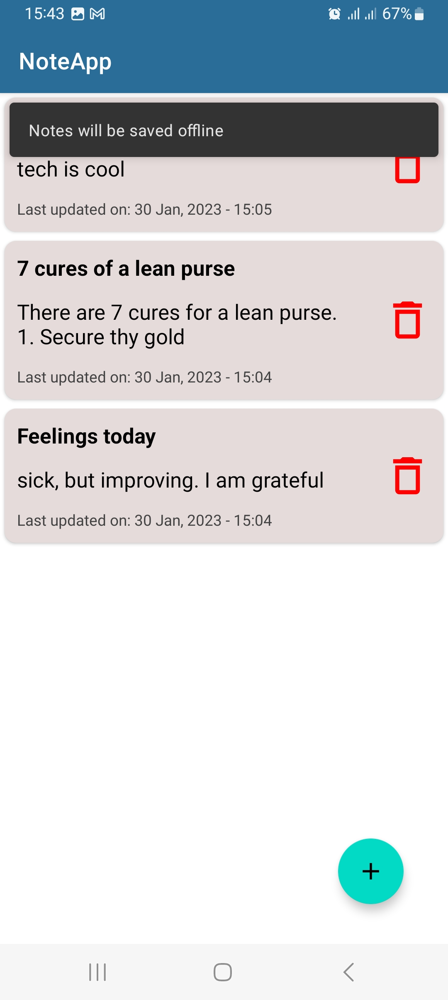
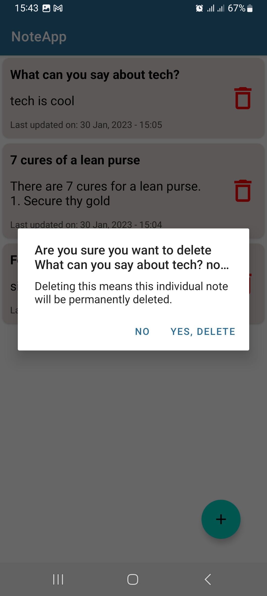
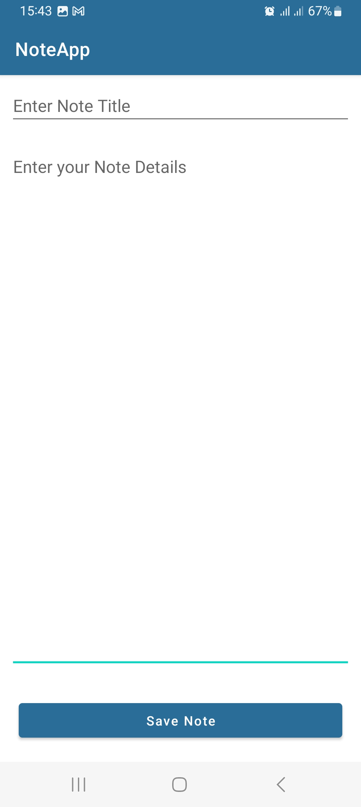
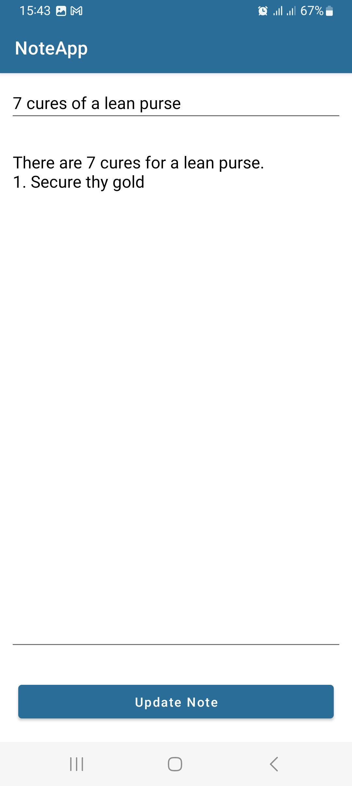

# Notes-App-with-Firebase-Firestore and ROOM Database

 

 

## Screenshots
 

 

 

## Built With

* [Kotlin](https://kotlinlang.org)
* [Firebase](https://firebase.google.com/)
* [Room](https://developer.android.com/training/data-storage/room)
* [Material Design](https://m2.material.io/develop/android)
* [Model-View-ViewModel(MVVM)](https://developer.android.com/topic/libraries/architecture/viewmodel)
* [ListAdapter & DiffUtil](https://developer.android.com/reference/kotlin/androidx/recyclerview/widget/ListAdapter)
* [LiveData](https://developer.android.com/topic/libraries/architecture/livedata)
* [View Binding](https://developer.android.com/topic/libraries/view-binding)
* [Clean Architecture](https://www.raywenderlich.com/3595916-clean-architecture-tutorial-for-android-getting-started)

 
